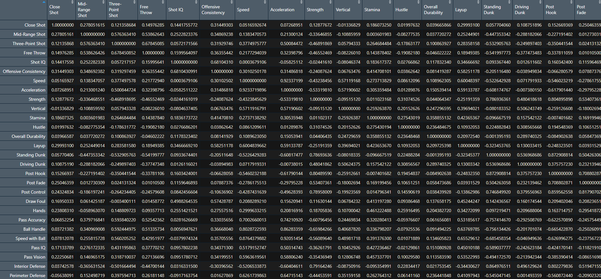

Primero queremos importar los datos con los que vamos a trabajar. En este caso trabajaremos con stats de jugadores de basketball obtenidos del último videojuego de la NBA "NBA2K20"

```{r}
data <- read.csv(file = "2K20_ratings.csv")
data
```

Pero queremos quedarnos sólo con las columnas numéricas, por lo tanto tenemos que quitarle la columna de Player

```{r}
df <- data[,c(2:37)]
df
```

Ahora podemos obtener la matriz de correlación de los datos

```{r}
df_corr <- cor(df)
```


Ahora importamos la librería que nos va ayudar a hacer el análisis factorial, que es library(psych)

```{r}
library(psych)
```

Y antes de hacer el análisis queremos ver cuáles son las variables que son aptas para este método, por lo cual antes haremos la prueba Kaiser-Meyer-Olkin (KMO). Para más información sobre este método pueden visitar el siguiente link: <https://www.statisticshowto.com/kaiser-meyer-olkin/>
```{r}
KMO(df_corr)
```
Esta prueba nos regresa el MSA o Measure of Sample Adequacy. En nuestro caso vemos que el overall MSA es de 0.87, por lo cual en general estos datos sí se adecuan mucho para un análisis factorial, pero también vemos que hay algunas variables que presentan un MSA muy bajo, por lo cual las quitaremos con el fin de tratar de mejorar el overall MSA un poco.

```{r}
df1 <- df[,c('Mid-Range Shot', 'Three-Point Shot', 'Free Throw', 'Offensive Consistency', 'Speed', 'Acceleration', 'Strength','Vertical', 'Stamina','Layup','Standing Dunk', 'Driving Dunk', 'Post Hook', 'Post Fade','Post Control', 'Draw Foul', 'Hands', 'Pass Accuracy', 'Ball Handle','Speed with Ball', 'Pass IQ', 'Pass Vision', 'Interior Defense','Perimeter Defense', 'Steal', 'Block', 'Lateral Quickness','Help Defense IQ', 'Pass Perception', 'Defensive Consistency','Offensive Rebound', 'Defensive Rebound')]
```

Quitamos las variables donde el MSA fuera menor a 0.7, y ahora volveremos a hacer el KMO test 

```{r}
df_corr1 <- cor(df1)
KMO(df_corr1)
```

Podemos observar que el overall MSA sí aumenta un poco y se podría aumentar más aunque por el momento es un MSA muy decente para poder aplicar análisis factorial

Pero antes de aplicar el análisis factorial tenemos que definir la cantidad de factores, por lo cual primero haré un plot de la matriz de correlación, el cual nos puede dar una idea de la cantidad de factores que deberiamos elegir 

```{r}
library(corrplot)
df1_corr <- cor(df1) 
col <- colorRampPalette(c("#BB4444", "#EE9988", "#FFFFFF", "#77AADD", "#4477AA"))
cex.before <- par("cex") #Cambiar tamaño de los números en del corrplot
par(cex = 0.3)
corrplot(round(df1_corr, 2), method="color", col=col(200),  
         type="upper", order="original",
         addCoef.col = "black", 
         tl.col="black", tl.srt=90, 
         diag=TRUE,tl.cex = 1.6,
        cl.cex = 2, addCoefasPercent = FALSE)
```
En este caso vemos que la representación no nos ayuda mucho pero en casos con menos varibles tal vez nos hubiera podido dar una idea más clara.

Ahora sí lo que podemos hacer para poder tener un mejor método para decidir la cantidad de factores, es usar la función "fa" de la libreria psych, que nos va ayudar a hacer un análisis exploratorio de factores


```{r}
nfactors <- 8 
nvars <- dim(df1_corr)[1]
#Es muy importante especificar ml(maximum likelihood) como el método
factors <- fa(r = df1_corr, nfactors = nfactors, rotate = "Varimax", fm="ml")
factors
```
Con la información del análisis exploratorio de factores podemos ver que 4 o 5 factores serían lo ideal, pero para estar seguros podemos hacer otra prueba que consiste en analizar la varinza que guarda cada eigenvector. Para esto podemos hacer otro plot.

```{r}
library(ggplot2)
# Del analisis anterior podemos sacar los eigenvalores
eigenvalues <- data.frame(factors$e.values)
colnames(eigenvalues) <- c("Values")
eigenvalues$Number <- 1:nrow(df1_corr)

eigenvalues$RepresentedVariance <- NA
for (i in 1:nrow(df1_corr)) {
    eigenvalues$RepresentedVariance[i] <- sum(eigenvalues$Values[1:i])/sum(eigenvalues$Values) * 
        100
}
eigenvalues$RepresentedVariance_text <- paste(round(eigenvalues$RepresentedVariance, 
    0), " %")

e1 <- ggplot(eigenvalues, aes(Number, y = Values), group = 1)
e1 <- e1 + geom_bar(stat = "identity")
e1 <- e1 + geom_line(aes(y = Values), group = 2)
e1 <- e1 + xlab("Number [-]")
e1 <- e1 + ylab("Eigenvalue [-]")
e1 <- e1 + geom_hline(aes(yintercept = 1), col = "red")
e1 <- e1 + geom_text(aes(label = RepresentedVariance_text), nudge_y = 0.2)
e1 <- e1 + ggtitle("Eigenvalues and explained Variance")
e1 <- e1 + theme_bw()
e1 <- e1 + scale_x_continuous(breaks = seq(1, 34, 1))
e1
```
En el gráfico podemos ver que con 5 eigenvectores ya podriamos representar 80% de la varianza. Así que con estos dos últimos test decidí tomar 5 factores para hacer el analisis factorial.

```{r}
nfactors <- 5 # Based on the screeplot suggestion
nvars <- dim(df1_corr)[1]
factors <- fa(r = df1_corr, nfactors = nfactors, rotate = "Varimax", fm="ml")
factors
```

Podemos representar los factores y sus varibles en un plot

```{r}
library(dplyr)
library(tidyr)
loadings_mat <- as.data.frame(matrix(nrow = nvars, ncol =nfactors))
loadings_mat$Variable <- colnames(df1)
for (i in 1:nfactors) {
  for (j in 1:nvars) {
    loadings_mat[j, i] <- factors$loadings[j, i]  
  }
}
colnames(loadings_mat) <- c("Factor1","Factor2", "Factor3", "Factor4","Factor5","Variable")
loadings_mat_gather <- loadings_mat %>% gather("Factor", "Value", 1:nfactors)
loadings_mat_gather
```


```{r}
g1 <- ggplot(loadings_mat_gather, aes(Variable, abs(Value), fill=Value))
g1 <- g1 + facet_wrap(~ Factor, nrow=1)
g1 <- g1 + geom_bar(stat="identity")
g1 <- g1 + coord_flip()
g1 <- g1 + scale_fill_gradient2(name = "Loading", 
                       high = "blue", mid = "white", low = "red", 
                       midpoint=0, guide=F) 
g1 <- g1 + xlab("Variable")  # improve x-axis label
g1 <- g1 + ylab("Factor Loading")  #improve y-axis label
g1 <- g1 + ggtitle("Factors")
g1 <- g1 + theme(axis.text=element_text(size=10),
        axis.title=element_text(size=12, face="bold"))
g1 <- g1 + theme(plot.title = element_text(size=12))
g1 <- g1 + theme_bw(base_size=12)
g1
```
En este gráfico podemos ver claramente cómo cada varible "encaja" en cada factor. Podemos ver qué tanta correlación tiene cada variable con cada factor. 

Y para terminar también vamos a generar una gráfica para el analisis factorial realizado en pasos previos

```{r}
cex.before <- par("cex") #Cambiar tamaño de los números en del corrplot
par(cex = 0.8)
fa.diagram(factors, rsize = 2, e.size = 0.03)
```

